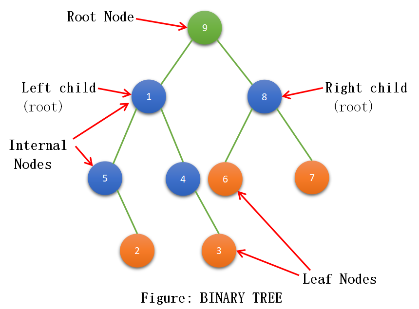

<div align="center">
<br>



</div>


<p align="center">


</p>


<h1 align="center"> C - Binary Trees </h1>


<h3 align="center">
<a href="https://github.com/RazikaBengana/holbertonschool-binary_trees#eye-about">About</a> •
<a href="https://github.com/RazikaBengana/holbertonschool-binary_trees#hammer_and_wrench-tasks">Tasks</a> •
<a href="https://github.com/RazikaBengana/holbertonschool-binary_trees#memo-learning-objectives">Learning Objectives</a> •
<a href="https://github.com/RazikaBengana/holbertonschool-binary_trees#computer-requirements">Requirements</a> •
<a href="https://github.com/RazikaBengana/holbertonschool-binary_trees#keyboard-more-info">More Info</a> •
<a href="https://github.com/RazikaBengana/holbertonschool-binary_trees#mag_right-resources">Resources</a> •
<a href="https://github.com/RazikaBengana/holbertonschool-binary_trees#bust_in_silhouette-authors">Authors</a> •
<a href="https://github.com/RazikaBengana/holbertonschool-binary_trees#octocat-license">License</a>
</h3>

---

<!-- ------------------------------------------------------------------------------------------------- -->

<br>
<br>

## :eye: About

<br>

<div align="center">

**`C - binary Trees`** project explores the concept of binary trees, including various types such as binary search trees (`BST`), `AVL trees`, and `heaps`.
<br>
<br>
The programs implement fundamental operations like insertion, deletion, traversal, and checking properties of binary trees, as well as more advanced concepts like finding lowest common ancestors, determining if a tree is `balanced` or `complete`, and performing rotations.
<br>
<br>
This project has been created by **[Holberton School](https://www.holbertonschool.com/about-holberton)** to enable every student to understand how `binary trees` in C language work.

</div>

<br>
<br>

<!-- ------------------------------------------------------------------------------------------------- -->

## :hammer_and_wrench: Tasks

<br>

**`0. New node`**

**`1. Insert left`**

**`2. Insert right`**

**`3. Delete`**

**`4. Is leaf`**

**`5. Is root`**

**`6. Pre-order traversal`**

**`7. In-order traversal`**

**`8. Post-order traversal`**

**`9. Height`**

**`10. Depth`**

**`11. Size`**

**`12. Leaves`**

**`13. Nodes`**

**`14. Balance factor`**

**`15. Is full`**

**`16. Is perfect`**

**`17. Sibling`**

**`18. Uncle`**

**`19. Lowest common ancestor`**

**`20. Level-order traversal`**

**`21. Is complete`**

**`22. Rotate left`**

**`23. Rotate right`**

**`24. Is BST`**

**`25. BST - Insert`**

**`26. BST - Array to BST`**

**`27. BST - Search`**

**`28. BST - Remove`**

**`29. Big O #BST`**

**`30. Is AVL`**

**`31. AVL - Insert`**

**`32. AVL - Array to AVL`**

**`33. AVL - Remove`**

**`34. AVL - From sorted array`**

**`35. Big O #AVL Tree`**

**`36. Is Binary heap`**

**`37. Heap - Insert`**

**`38. Heap - Array to Binary Heap`**

**`39. Heap - Extract`**

**`40. Heap - Sort`**

**`41. Big O #Binary Heap`**

<br>
<br>

<!-- ------------------------------------------------------------------------------------------------- -->

## :memo: Learning objectives

<br>

**_You are expected to be able to [explain to anyone](https://fs.blog/feynman-learning-technique/), without the help of Google:_**

<br>

```diff

General

+ What is a binary tree

+ What is the difference between a binary tree and a Binary Search Tree

+ What is the possible gain in terms of time complexity compared to linked lists

+ What are the depth, the height, the size of a binary tree

+ What are the different traversal methods to go through a binary tree

+ What is a complete, a full, a perfect, a balanced binary tree

```

<br>
<br>

<!-- ------------------------------------------------------------------------------------------------- -->

## :computer: Requirements

<br>

```diff

General

+ Allowed editors: vi, vim, emacs

+ All your files will be compiled on Ubuntu 20.04 LTS using gcc, using the options -Wall -Werror -Wextra -pedantic -std=gnu89

+ All your files should end with a new line

+ A README.md file, at the root of the folder of the project, is mandatory

+ Your code should use the Betty style. It will be checked using betty-style.pl and betty-doc.pl

- You are not allowed to use global variables

+ No more than 5 functions per file

+ You are allowed to use the standard library

+ In the following examples, the main.c files are shown as examples. You can use them to test your functions, but you don’t have to push them to your repo (if you do we won’t take them into account). We will use our own main.c files at compilation. Our main.c files might be different from the one shown in the examples

+ The prototypes of all your functions should be included in your header file called binary_trees.h

+ Don’t forget to push your header file

+ All your header files should be include guarded

```

<br>

**_Why all your files should end with a new line? See [HERE](https://unix.stackexchange.com/questions/18743/whats-the-point-in-adding-a-new-line-to-the-end-of-a-file/18789)_**

<br>
<br>

### GitHub

<br>

There should be one project repository per group. <br>
If you clone/fork/whatever a project repository with the same name before the second deadline, you risk a 0% score.

<br>
<br>

<!-- ------------------------------------------------------------------------------------------------- -->

## :keyboard: More Info

<br>

### Data Structures:

<br>

- Please use the following data structures and types for `binary trees`. <br>
Don’t forget to include them in your header file.

<br>
<br>

#### Basic Binary Tree:

<br>

```yaml
/**
 * struct binary_tree_s - Binary tree node
 *
 * @n: Integer stored in the node
 * @parent: Pointer to the parent node
 * @left: Pointer to the left child node
 * @right: Pointer to the right child node
 */
struct binary_tree_s
{
    int n;
    struct binary_tree_s *parent;
    struct binary_tree_s *left;
    struct binary_tree_s *right;
};

typedef struct binary_tree_s binary_tree_t;
```

<br>
<br>

#### Binary Search Tree:

<br>

```yaml
typedef struct binary_tree_s bst_t;
```

<br>
<br>

#### AVL Tree:

<br>

```yaml
typedef struct binary_tree_s avl_t;
```

<br>
<br>

#### Max Binary Heap:

<br>

```yaml
typedef struct binary_tree_s heap_t;
```

<br>
<br>

:pushpin: **Note**:
<br>
<br>
For tasks **0** to **23** (included), you have to deal with simple binary trees. <br>
They are not `BSTs`, thus they don’t follow any kind of rule.

<br>
<br>

### Print function:

<br>

- To match the examples in the tasks, you are given [this function](https://github.com/hs-hq/0x1C.c). <br>

  - This function is used only for visualization purposes. <br>
  You don’t have to push it to your repo. <br>
  It may not be used during the correction. <br>

<br>
<br>

<!-- ------------------------------------------------------------------------------------------------- -->

## :mag_right: Resources

<br>

**_Do you need some help?_**

<br>

**Read or watch:**

* [Binary tree](https://en.wikipedia.org/wiki/Binary_tree)
  - :warning: Note the first line: **Not to be confused with `B-tree`**.

* [Data Structure and Algorithms - Tree](https://www.tutorialspoint.com/data_structures_algorithms/tree_data_structure.htm)

* [Tree Traversal](https://www.tutorialspoint.com/data_structures_algorithms/tree_traversal.htm)

* [Binary Search Tree](https://en.wikipedia.org/wiki/Binary_search_tree)

* [Data structures: Binary Tree](https://www.youtube.com/watch?v=H5JubkIy_p8)

<br>
<br>

<!-- ------------------------------------------------------------------------------------------------- -->

## :bust_in_silhouette: Authors

<br>

**${\color{blue}Razika \space Bengana}$**

<br>
<br>

<!-- ------------------------------------------------------------------------------------------------- -->

## :octocat: License

<br>

```C - binary Trees``` _project has no license specified._

<br>
<br>

---

<p align="center"><br>2022</p>